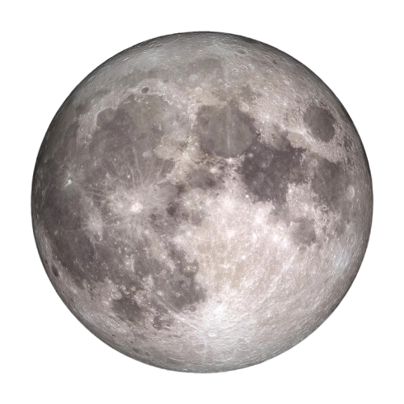
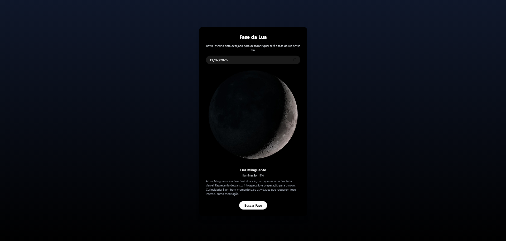

# 🌙 Fases da Lua

Projeto que calcula e mostra as fases da Lua de forma **offline**, utilizando uma API própria em Node.js e um front-end moderninho com Tailwind.



O objetivo do projeto é demonstrar conceitos de:
- Criação de APIs REST
- Cálculo astronômico básico
- Integração front-end e back-end
- Organização de projeto para portfólio

---

## 📸 Preview

Aplicação web que mostra:
- Imagem realista da Lua
- Nome da fase atual
- Porcentagem de iluminação
- Descrição resumida de cada fase



---

## 🚀 Tecnologias utilizadas

- Node.js
- Express
- JavaScript
- Tailwind CSS
- HTML5

---

## 🚀 Como rodar o projeto

```bash
1. Clone o repositório:
git clone https://github.com/SEU_USUARIO/SEU_REPOSITORIO.git

2. Acesse a pasta do projeto:
cd api-lua

3. Instale as dependências:
npm install

Rode o projeto:
npm run dev
A API estará disponível na porta:
http://localhost:3000/lua/hoje
```

## 🧠 Como funciona

A fase da Lua é calculada localmente com base no ciclo lunar médio, sem depender de outras APIs externas.

O cálculo utiliza:
- Uma data de Lua Nova como referência
- O tempo decorrido desde essa data
- Divisão do ciclo lunar em 8 fases principais

Isso garante que a aplicação funcione mesmo sem conexão com serviços externos.

---

## 📡 Endpoints da API

### `GET /lua/hoje`

Retorna a fase atual da Lua.

Exemplo de resposta:


```json
{
  "data": "2026-02-13",
  "fase": "Lua Cheia",
  "iluminacao": 98,
  "imagem": "http://localhost:3000/images/lua-cheia.png"
}


